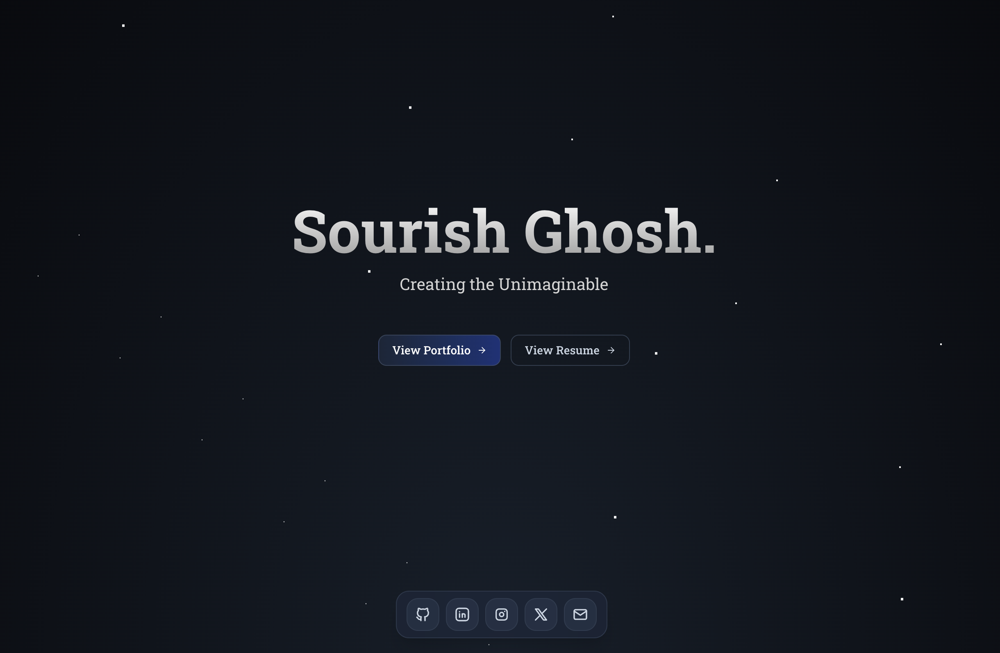

# my-links

**my-links** is a pre-portfolio website built with Next.js. It serves as a personal landing page to showcase your most important links, social profiles, and projects before launching your full portfolio.

## Features
- Clean, modern design
- Responsive and fast
- Easy to customize links and appearance
- Built with Next.js and TypeScript

## Customization

- Edit your links and content in `app/page.tsx` and components in the `components/` folder.
- Update the site appearance in `app/globals.css` and `components/ui/`.

## About

This project is a simple, effective way to direct visitors to your key online destinations while your main portfolio is in progress.

---

Built with [Next.js](https://nextjs.org/).
